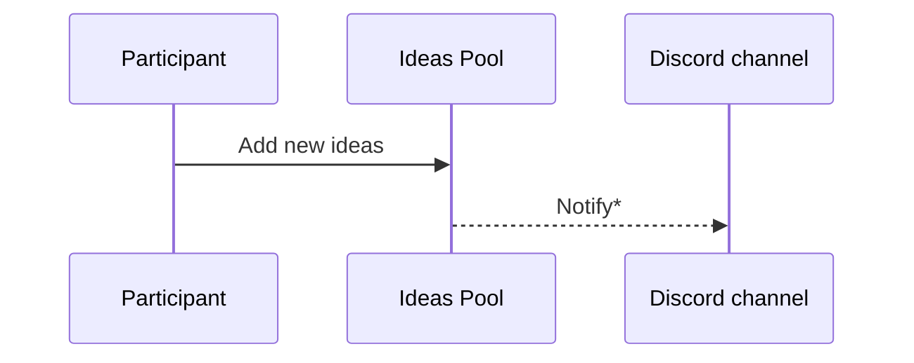
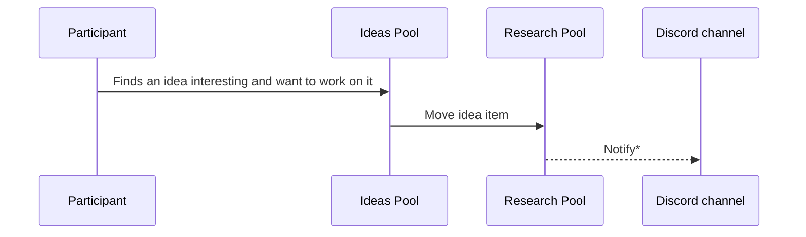

# AI-In-Practice Working Group

This is the main repository of the AI-In-Practice Working Group.

The AI-In-Practice Working Group aims to co-develop publicly shared references (code / best-practices) on practical applications of AI for areas such as productivity, security, governance, sustainability & culture, with an emphasis on collaborative learning (i.e. learning by doing) and [learning in public](https://www.swyx.io/learn-in-public).

A Working Group is like a Study Group, but instead of preparing to pass an exam, participants focus on discussions and activities around a specific subject area. Think of it like an extended Hackathon, where a Hackathon focuses on intense collaboration within a day or two, the Working Group collaborates over 5 two-hour sessions, spread out over 5 months. 

> *Wikipedia Working Group definition:* A group of experts working together to achieve specified goals. Such groups are domain-specific and focus on discussion or activity around a specific subject area. The term can sometimes refer to an interdisciplinary collaboration of researchers, often from more than one organization, working on new activities that would be difficult to sustain under traditional funding mechanisms.

## Principles

1. Codify & automate when necessary/easy
2. [Learn in public](https://www.swyx.io/learn-in-public)
3. Participation is a [Non-event]()
4. Less theory, more practice
5. Pivot when necessary

## How it works

Here are the activities that participants can participate in.

### Add new ideas

Ideas can be added to the Ideas pool. 
Ideas need not be assigned to anyone in particular.
The idea creator does not necessarily need to work on the idea (see next section).

\* This (dotted sequence) is not available yet, follow [this ticket on GitHub Projects for updates](https://github.com/orgs/apacgps/projects/9/views/1?pane=issue&itemId=94341940)

### Work (research) on an idea

One or more participants can pick up an idea to research on. Do move the idea item from the *Ideas Pool* to the *Research Pool* to let the group know that it's being worked on so that it can in turn inform what areas or other ideas they may want to pick up.

\* This (dotted sequence) is not available yet, follow [this ticket on GitHub Projects for updates](https://github.com/orgs/apacgps/projects/9/views/1?pane=issue&itemId=94341940)

### Discuss an idea

* Asynchronously discuss ideas on Discord (WIP)
* Can also discuss in monthly meeting

### Present/demo research 

* At monthly meetings

## Chapters

* Chapter 1 (2025 CYH1): [Content Review for AI](content-review/README.md)