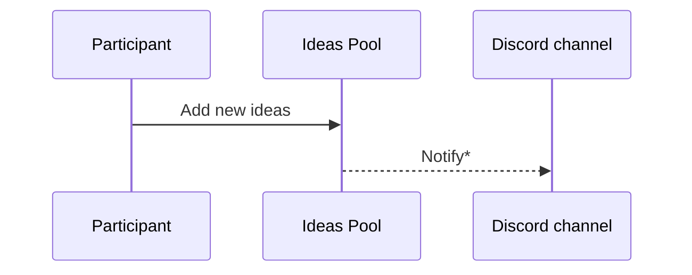
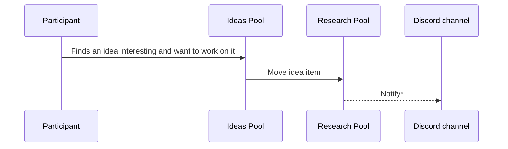
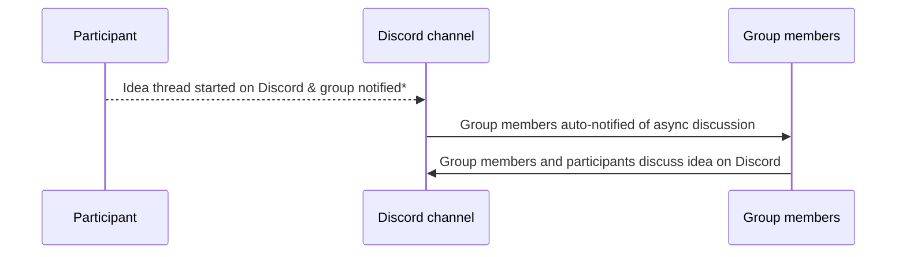
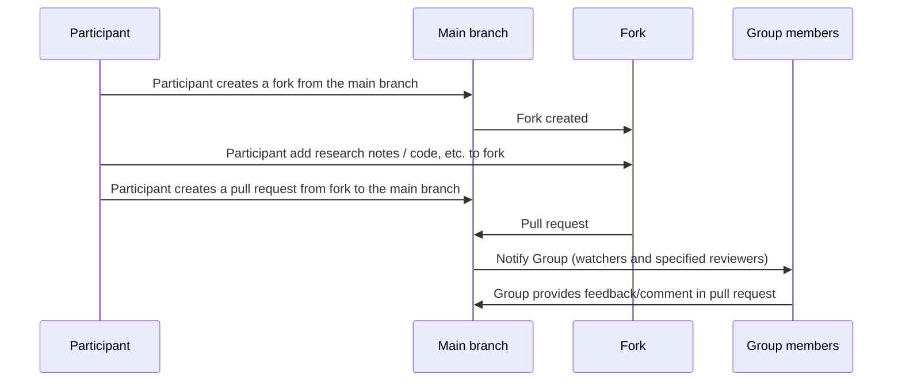
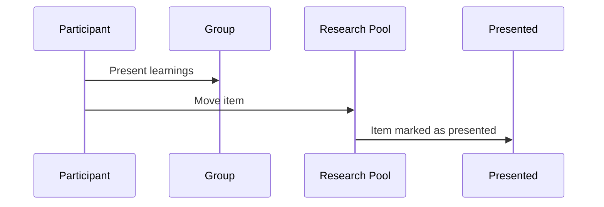

# AI-In-Practice Working Group

This is the main repository of the AI-In-Practice Working Group.

The AI-In-Practice Working Group aims to co-develop publicly shared references (code / best-practices) on practical applications of AI for areas such as productivity, security, governance, sustainability & culture, with an emphasis on collaborative learning (i.e. learning by doing) and [learning in public](https://www.swyx.io/learn-in-public).

A Working Group (WG) is like a Study Group, but instead of preparing to pass an exam, participants focus on discussions and activities around a specific subject area. Think of it like an extended Hackathon, where a Hackathon focuses on intense collaboration within a day or two, the Working Group collaborates over 5 two-hour sessions, spread out over 5 months. 

> *Wikipedia Working Group definition:* A group of experts working together to achieve specified goals. Such groups are domain-specific and focus on discussion or activity around a specific subject area. The term can sometimes refer to an interdisciplinary collaboration of researchers, often from more than one organization, working on new activities that would be difficult to sustain under traditional funding mechanisms.

## Principles

1. Codify & automate when necessary/easy
2. [Learn in public](https://www.swyx.io/learn-in-public)
3. Participation is a [Non-event]()
4. Less theory, more practice
5. Pivot when necessary

## Ground rules

* Pro-actively participate in ideation, research & discussions whenever possible
* Adhere to ethical principals in AI development including fairness, transparency, accountability and respect for user privacy
* Encourage continuous learning and improvement
* Early pivoting of group’s topic of focus (before 3rd meeting) is OK based on general consensus of  working group participants
* Foster an environment where all participants are respected & feel comfortable to share their ideas, concerns and feedback

## How it works

Here are the activities that participants can participate in.

It is important that these are defined because of the asynchronous cross-organization collaborative learning nature of the WG.

Central to the communication structure of these activities is the Ideas board which comprises of 3 pools denominating each stage of a work/learn/research item:

* Ideas Pool
* Research Pool
* Presented

### Add new ideas

Ideas can be added to the Ideas pool. 
Ideas need not be assigned to anyone in particular.
The idea creator does not necessarily need to work on the idea (see next section).

\* This (dotted sequence) is not available yet, follow [this ticket on GitHub Projects for updates](https://github.com/orgs/apacgps/projects/9/views/1?pane=issue&itemId=94341940)

### Work (research) on an idea

One or more participants can pick up an idea to research on. Do move the idea item from the *Ideas Pool* to the *Research Pool* to let the group know that it's being worked on so that it can in turn inform what other ideas they may want to pick up.

\* This (dotted sequence) is not available yet, follow [this ticket on GitHub Projects for updates](https://github.com/orgs/apacgps/projects/9/views/1?pane=issue&itemId=94341940)

### Discuss an idea/research

Ideas can be discussed asynchronously on Discord (start a thread with reference/link to the Idea item on the board):

Participants are encouraged to asynchronously discuss an idea on GitHub. It is recommended that Participants fork the main aipwg repository and add notes to the fork. Pull requests to the main branch can be created to start a discussion.

Lastly, ideas can also be discussed in monthly meetup.

### Present/demo research 

When ideas are sufficiently researched, it can be presented at the monthly meetup. 

Once presented, the item should be then be moved to the Presented swimlane in the board.

Participant can merge / commit any remaining notes / best-practices / code, etc. to the main branch.

Presented ideas can span newer ideas, but those should be new items added to the Ideas pool to allow ideas and research to come to a certain conclusion.

## Chapters

* Chapter 1 (2025 CYH1): [Content Review for AI](content-review/README.md)

## Working Group meta improvements

Participants can opt to work on the continuous improvement of the Working Group as well, i.e. reusable tools, libraries that can be re-used across chapters, etc.

The working group backlog can be found [here](https://github.com/orgs/apacgps/projects/9/views/1).