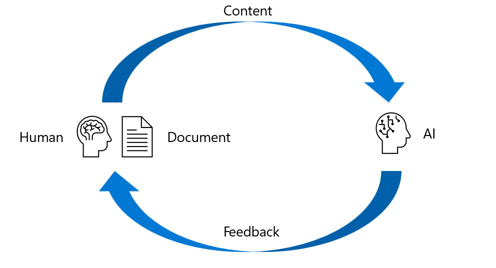

# Content Review for AI

* AI to review modifications, additions, or conclusions from an existing content (corpus). Use-cases include review of:
    * Additions to an existing content (corpus)
    * Modifications to a design
    * A certain conclusion vs the existing content
* The A.I-based review can check for ethical, logical, security, sustainability & cultural concerns; as relevant to the content.
* Serve as the basis for a wide range of AI solutions such as:
    * Content management
    * Software development
    * Analysis agent
