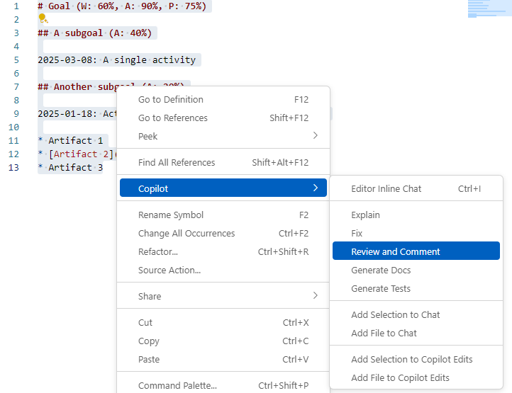
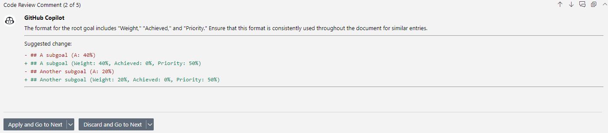

# GitHub Copilot (Review Selection feature)

In this exercise, we go through GitHub Copilot's Review Selection feature as applied to ```base_example.md```



## Outcome




This is an example of how content review AI within GitHub Copilot can be  useful even without any guidance. GitHub Copilot tries to achieve consistency here, something which I initially suggested as a manual prompt in the Kurashi language specifications (not included here as context).

## Learning points

* It is not possible to specify the LLM to use, nor any additional context files to refer to with this method. At the time of writing, the LLM used is GPT-4o.

* This mode is useful for generic code review but it is better to use GitHub Copilot Chat for a deeper, more contextual review. We will also explore the use of GitHub Copilot Review Changes for a more workflow-embedded way of content (change) review.