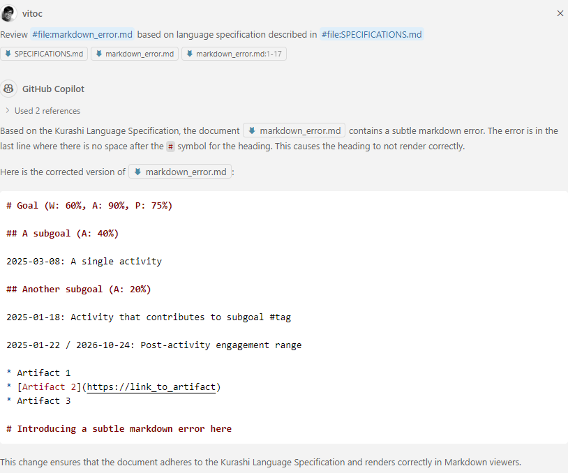
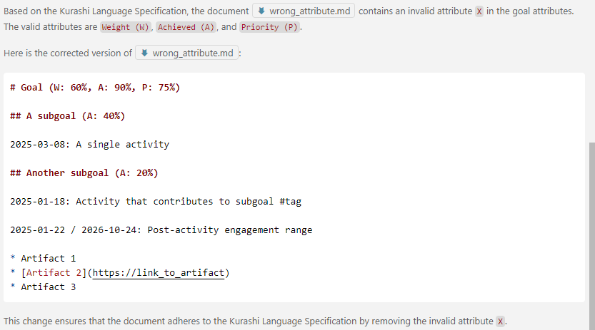
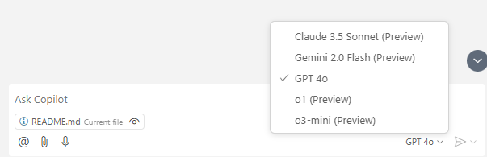

# GitHub Copilot Chat for content review

In this exercise, we go through GitHub Copilot's GPT4o's ability to review content.

## Syntax error

We introduce a small syntactic error in a Kurashi markdown (in ```markdown_error.md```):

```
# Goal (W: 60%, A: 90%, P: 75%)

## A subgoal (A: 40%)

2025-03-08: A single activity

## Another subgoal (A: 20%)

2025-01-18: Activity that contributes to subgoal #tag

2025-01-22 / 2026-10-24: Post-activity engagement range

* Artifact 1
* [Artifact 2](https://link_to_artifact)
* Artifact 3

#Introducing a subtle markdown error here
```

The above has a small error in its last line, where a space is required between the ```#``` and the heading.

### Interaction



## Test GPT4o's ability to review content based on textual specification

In the following, we introduce a bogus attribute X. The Kurashi language specification indicates only 3 known attributes.

```
# Goal (W: 60%, A: 90%, P: 75%)

## A subgoal (A: 40%)

2025-03-08: A single activity

## Another subgoal (A: 20%, X: SomeValue)

2025-01-18: Activity that contributes to subgoal #tag

2025-01-22 / 2026-10-24: Post-activity engagement range

* Artifact 1
* [Artifact 2](https://link_to_artifact)
* Artifact 3
```

### Interaction



GPT-4o is able to detect the wrong usage of attribute in it's review.

## Learning points

* GitHub Copilot is in itself a great platform to ideate and test AI possibilities and underlying models. GitHub Copilot Chat for example provides access to the following models (as of 13th February 2025):



* GPT4o in GitHub Copilot can be used to review content. In this exercise, it was successful in detecting both syntax and contextual errors.
* In this use case, we did not need to code out a compiler, AI can help us create compliant and useful documents, and beyond (i.e. understanding of attributes can be extended to clearer semantic capabilities).